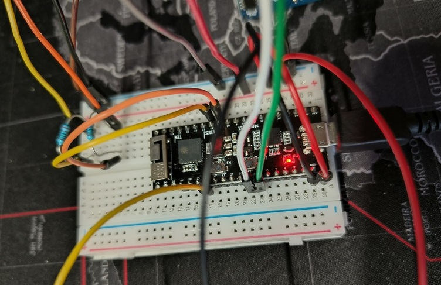
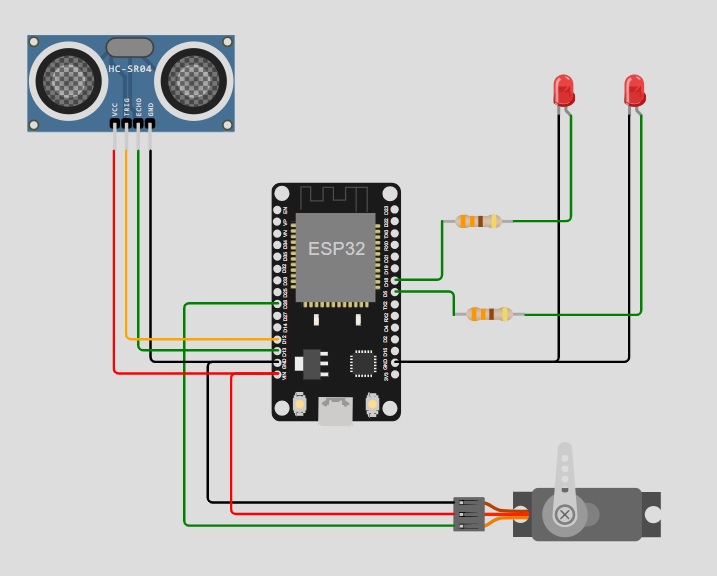
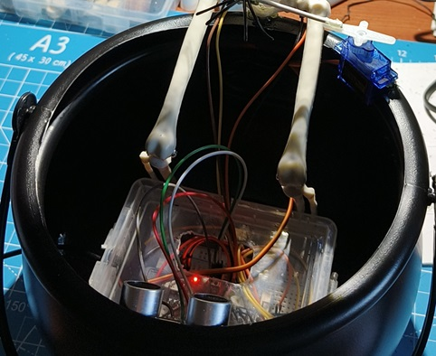
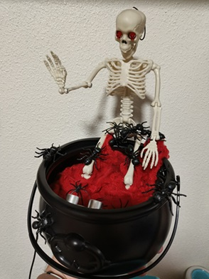

# Halloween Trick-or-Treat ESP32 tiny project

## Summary
This project is designed to create an interactive Halloween trick-or-treat experience using PlatformIO. The project involves programming a microcontroller to control various Halloween-themed devices and sensors. Ready to be included in your halloween crafts!



## Functionality
- **Motion Detection**: Detects motion through ultrasonic sensor to activate a servo motor. Attach it on your Halloween artifacts!
- **Lighting Control**: Enable two LED lights automatically due to motion detection to create a spooky atmosphere.
- **Actuator**: Allows the activation of a servo motor when a terrifying object is detected!

## How to Build and Deploy

### Prerequisites
- PlatformIO IDE installed
- Compatible microcontroller: ESP32 (developed on a ESP32 pico dev kit)
- Required sensors and actuators: HC-SR04 ultrasonic sensor, Micro servo 99, two red LEDs, two resistors, wires and a power source

### Building and Deploying the Project

1. [Install PlatformIO Core](https://docs.platformio.org/page/core.html)
2. Download [development platform with examples](https://github.com/platformio/platform-espressif32/archive/develop.zip)
3. Extract ZIP archive
4. Run these commands:

```shell
git clone https://github.com/jfontecha/trick-or-treat-esp32.git
# Change directory to example
$ cd trick-or-treat-esp32

# Build project
$ pio run

# Upload firmware
$ pio run --target upload

# Build specific environment
$ pio run -e esp32dev

# Upload firmware for the specific environment
$ pio run -e esp32dev --target upload

# Clean build files
$ pio run --target clean
```

### Ports and Connections

Below is a table detailing the ports and connections for the sensors and actuators to the ESP32 microcontroller:

| Component         | ESP32 Pin                     | 
|-------------------|-------------------------------|
| Ultrasonic Sensor | GPIO 12 (trigger) 13 (echo)   | 
| Servo motor       | GPIO 26                       | 
| LED 1             | GPIO 18                       | 
| LED 2             | GPIO 5                        | 

Ensure all connections are secure and double-check the pin assignments in your code.

### Connection Diagram

Below is a visual representation of the connections for the sensors and actuators to the ESP32 microcontroller:




Enjoy your interactive Halloween setup!



